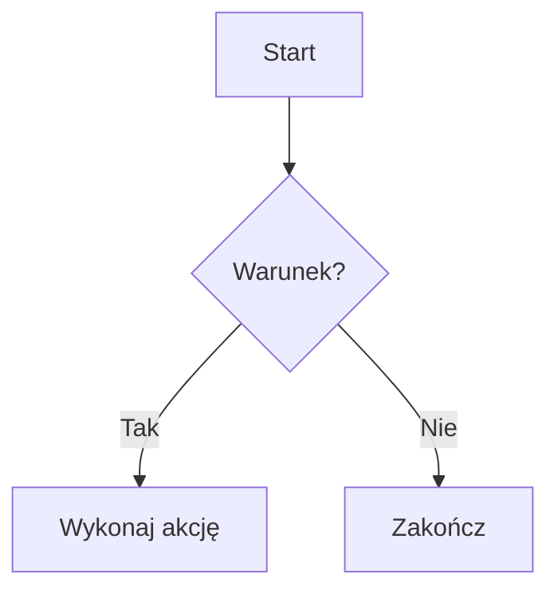
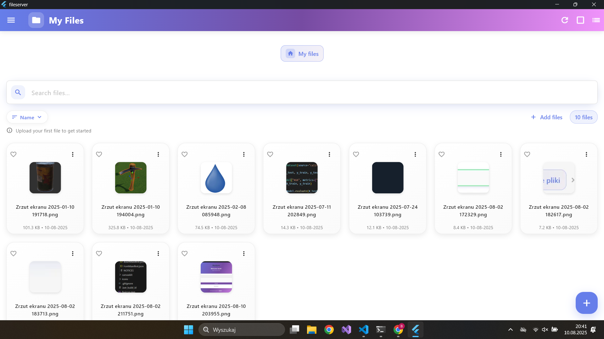
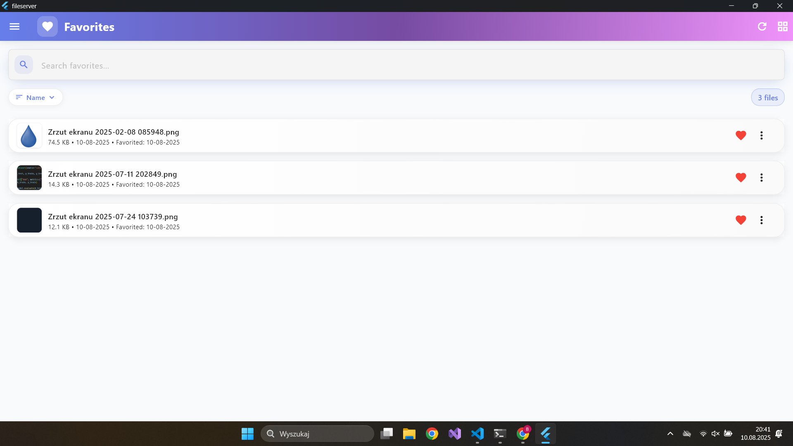
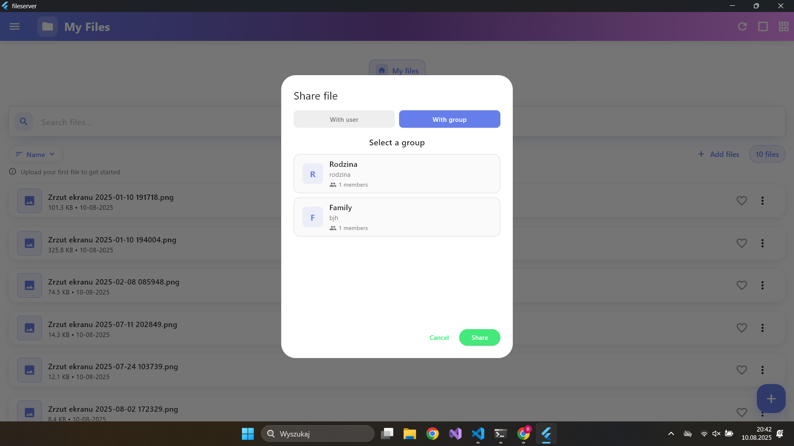
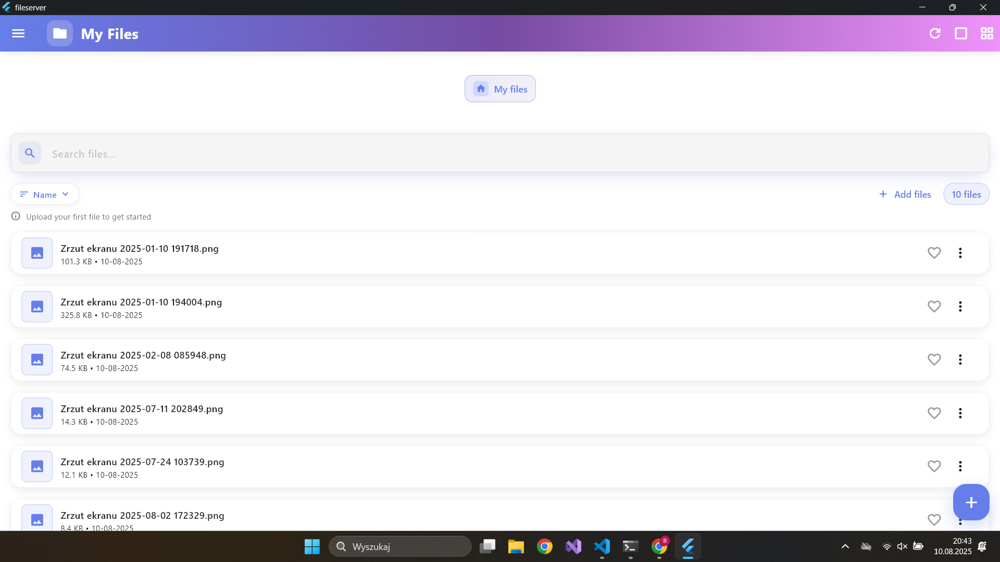

# SkySync - File Management Application


## Overview

SkySync is a modern file management application built with Flutter that provides secure file storage, sharing and management capabilities. The application features a comprehensive error handling system, multi-language support, and an intuitive user interface.

## Features

### 🔐 **Authentication & Security**

- User registration and login with email verification
- JWT token-based authentication
- Password reset functionality
- Secure file access control

### 📁 **File Management**

- Upload and download files
- Create and manage folders
- Rename files
- Share files with other
- File organization and navigation
- Bulk file operations (select, delete, move)
- File search and filtering
- Files preview
- Favorites system

### ⭐ **Favorites System**

- Mark files as favorites for quick access
- Dedicated favorites page
- Easy management of favorite files

### 🔗 **File Sharing**

- Share files with other users
- Share entire folders
- Share with groups
- Quick share functionality via QR code
- View shared files and folders

### 🌐 **Multi-language Support**

- Polish and English localization
- Automatic language detection
- Easy to extend with new languages

### 🛡️ **Advanced Error Handling**

- Comprehensive error management system
- User-friendly error messages
- Retry functionality for recoverable errors
- Different error display methods (dialogs, snackbars, banners)

## Technology Stack

- **Frontend**: Flutter 3.7.2+
- **State Management**: Provider
- **HTTP Client**: http package
- **Local Storage**: SharedPreferences
- **File Handling**: file_picker, path_provider
- **Localization**: easy_localization
- **QR Code**: qr_flutter

## First look



|    Demo images           |   Demo images            |
|-----------------------|-----------------------|
|  |  |
|  |  |
|  |  |


## Getting Started

### Prerequisites

- Flutter SDK 3.7.2 or higher
- Dart SDK
- Android Studio / VS Code
- Backend API server [Readme](SERVER.md)

### Installation

1. **Clone the repository**

   ```bash
   git clone <repository-url>
   cd fileserver
   ```

2. **Install dependencies**

   ```bash
   flutter pub get
   ```

3. **Configure environment**
   - Create a `.env` file in the root directory
   - Add your API configuration:
   ```
   API_KEY=your_api_key_here
   BASE_URL=http://your-backend-url:8000
   ```

4. **Run the application**

   ```bash
   flutter run
   ```


## Project Structure

```
lib/
├── main.dart                 # Application entry point
├── pages/                    # Application pages
│   ├── login_page.dart       # Login screen
│   ├── register_page.dart    # Registration screen
│   ├── main_page.dart        # Main dashboard
│   ├── files_page.dart       # File management
│   ├── favorites_page.dart   # Favorites
│   ├── shared_files_page.dart # Shared files
│   └── settings_page.dart    # Settings
├── utils/                    # Utility classes
│   ├── api_service.dart      # API communication
│   ├── token_service.dart    # Token management
│   ├── custom_widgets.dart   # Reusable widgets
│   ├── error_handler.dart    # Error handling system
│   └── error_widgets.dart    # Error display widgets
└── assets/
    └── lang/                 # Localization files
        ├── en.json          # English translations
        └── pl.json          # Polish translations
```

## Error Handling System

The application includes a comprehensive error handling system that provides:

- **Centralized Error Management**: All errors are handled through a single system
- **Error Classification**: Errors are categorized by type (network, authentication, validation, etc.)
- **User-Friendly Messages**: Clear, localized error messages
- **Retry Functionality**: Automatic retry for recoverable errors
- **Multiple Display Methods**: Dialogs, snackbars, banners, and widgets

### Error Types

- `network` - Network connection issues
- `authentication` - Login/authorization errors
- `authorization` - Permission errors
- `validation` - Data validation errors
- `server` - Backend server errors
- `file` - File operation errors
- `unknown` - Unclassified errors

### Usage Examples

```dart
// In API calls
try {
  final response = await ApiService.loginUser(email, password);
  // Handle success
} catch (e) {
  final appError = e is AppError ? e : ErrorHandler.handleError(e, null);
  ErrorHandler.showErrorSnackBar(context, appError);
}

// Using error widgets
RetryableErrorWidget(
  error: appError,
  onRetry: () => _retryOperation(),
)
```

## API Integration

The application communicates with a backend API for all file operations. Key endpoints include:

- `POST /create_user` - User registration
- `POST /login` - User authentication
- `POST /list_files` - Get file list
- `POST /upload_file` - Upload files
- `DELETE /delete_file/{path}` - Delete files
- `GET /download_file/{path}` - Download files
- `POST /share_file` - Share files
- `GET /get_shared_files` - Get shared files

## Localization

The application supports multiple languages through the `easy_localization` package. To add a new language:

1. Create a new JSON file in `assets/lang/`
2. Add all required translation keys
3. Update the supported locales in `main.dart`

## Building for Production

### Android

```bash
flutter build apk --release
```

### iOS

```bash
flutter build ios --release
```

### Web

```bash
flutter build web --release
```

## Contributing

1. Fork the repository
2. Create a feature branch
3. Make your changes
4. Add tests if applicable
5. Submit a pull request

## License

This project is licensed under the MIT License - see the LICENSE file for details.

## Roadmap

- [ ] Offline mode support
- [ ] Advanced search filters
- [ ] File versioning
- [ ] Real-time collaboration
- [ ] Cloud storage integration
- [ ] Advanced security features (2FA, encryption) 
