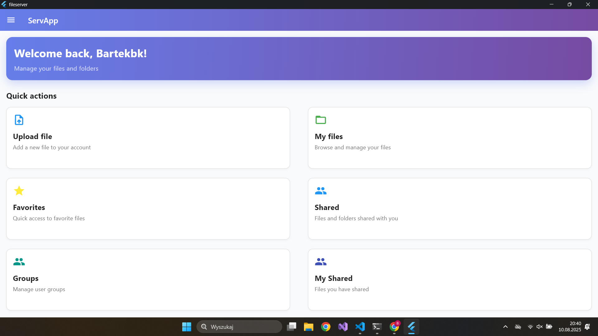
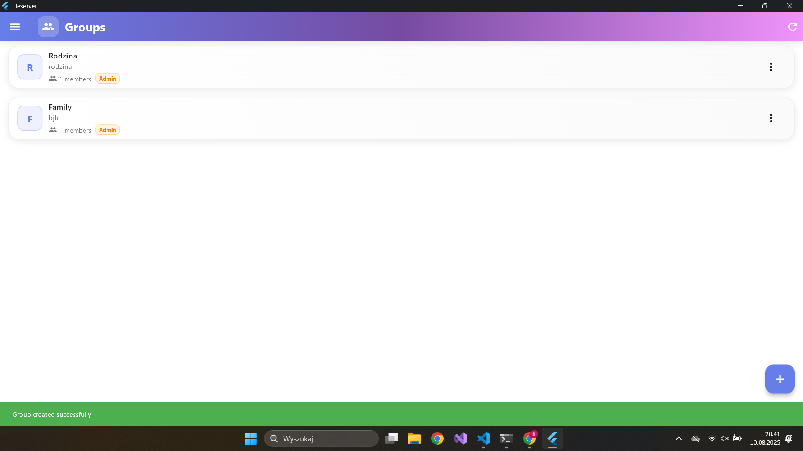

# SkySync - File Management Application

<p align="center">
  
</p>

## Overview

SkySync is a modern file management application built with Flutter that provides secure file storage, sharing and management capabilities. The application features a comprehensive error handling system, multi-language support, automatic update notifications, and an intuitive user interface.

## Features

### 🔐 **Authentication & Security**

- User registration and login with email verification
- JWT token-based authentication
- Password reset functionality
- Secure file access control

### 📁 **File Management**

- Upload and download files
- Create and manage folders
- Rename files
- Share files with other users
- File organization and navigation
- Bulk file operations (select, delete, move)
- File search and filtering
- **Advanced file preview** (images, PDFs, spreadsheets, text files)
- Favorites system
- **File caching** for improved performance
- **Activity tracking** for file operations

### ⭐ **Favorites System**

- Mark files as favorites for quick access
- Dedicated favorites page
- Easy management of favorite files

### 🔗 **File Sharing**

- Share files with other users
- Share entire folders
- Share with groups
- Quick share functionality via QR code
- View shared files and folders
- **Shared file preview** with dedicated widgets

### 🌐 **Multi-language Support**

- Polish and English localization
- Automatic language detection
- Easy to extend with new languages

### 🛡️ **Advanced Error Handling**

- Comprehensive error management system
- User-friendly error messages
- Retry functionality for recoverable errors
- Different error display methods (dialogs, snackbars, banners)

### 🔄 **Automatic Updates**

- **Smart update notifications** - only shows when newer version is available
- **Version comparison** between app and server versions
- **Persistent version storage** using SharedPreferences
- **Automatic update checking** on app startup
- **Download links** for new versions

### 🎨 **Customization**

- **Customizable theme colors** with color picker
- **Font size options** (small, medium, large)
- **Default view preferences** (list, grid)
- **Sorting preferences** for files
- **Persistent settings** across app sessions

## Technology Stack

- **Frontend**: Flutter 3.7.2+
- **State Management**: Provider
- **HTTP Client**: http package
- **Local Storage**: SharedPreferences
- **File Handling**: file_picker, path_provider
- **Localization**: easy_localization
- **QR Code**: qr_flutter
- **Version Management**: package_info_plus
- **PDF Viewing**: syncfusion_flutter_pdfviewer
- **Image Caching**: cached_network_image
- **Notifications**: flutter_local_notifications
- **File Opening**: open_file

## First look

|    Demo images           |   Demo images            |
|-----------------------|-----------------------|
|  |  |
|  |  |
|  |  |

## Getting Started

### Prerequisites

- Flutter SDK 3.7.2 or higher
- Dart SDK
- Android Studio / VS Code
- Backend API server [Readme](SERVER.md)

### Installation

1. **Clone the repository**

   ```bash
   git clone https://github.com/B4rtekk1/Skysync.git
   cd fileserver
   ```

2. **Install dependencies**

   ```bash
   flutter pub get
   ```

3. **Configure environment**
   - Create a `.env` file in the root directory
   - Add your API configuration:

   ```bash
   API_KEY=your_api_key_here
   BASE_URL=http://your-backend-url:8000
   ```

4. **Run the application**

   ```bash
   flutter run
   ```

5. **Build release version**

   ```bash
   flutter build windows --release
   flutter build apk --release
   #etc.

## Project Structure

```bash
lib/
├── main.dart                 # Application entry point
├── pages/                    # Application pages
│   ├── login_page.dart       # Login screen
│   ├── register_page.dart    # Registration screen
│   ├── main_page.dart        # Main dashboard
│   ├── files_page.dart       # File management
│   ├── favorites_page.dart   # Favorites
│   ├── shared_files_page.dart # Shared files
│   ├── my_shared_files_page.dart # My shared files
│   ├── groups_page.dart      # Groups management
│   ├── shared_folder_contents_page.dart # Shared folder contents
│   ├── forgot_password_page.dart # Password reset
│   ├── reset_password_page.dart # Password reset form
│   ├── delete_account_page.dart # Account deletion
│   ├── verification_page.dart # Email verification
│   ├── error_demo_page.dart  # Error handling demo
│   └── settings_page.dart    # Settings
├── utils/                    # Utility classes
│   ├── api_service.dart      # API communication
│   ├── token_service.dart    # Token management
│   ├── version_service.dart  # Version management
│   ├── cache_service.dart    # File caching
│   ├── storage_service.dart  # Storage operations
│   ├── activity_service.dart # Activity tracking
│   ├── notification_service.dart # Notifications
│   ├── app_settings.dart     # App settings management
│   ├── file_utils.dart       # File utilities
│   ├── custom_widgets.dart   # Reusable widgets
│   ├── error_handler.dart    # Error handling system
│   └── error_widgets.dart    # Error display widgets
├── widgets/                  # Custom widgets
│   ├── update_notification_widget.dart # Update notifications
│   ├── color_picker_dialog.dart # Color picker
│   ├── image_preview_widget.dart # Image preview
│   ├── pdf_preview_widget.dart # PDF preview
│   ├── spreadsheet_preview_widget.dart # Spreadsheet preview
│   ├── text_preview_widget.dart # Text preview
│   ├── shared_*_preview_widget.dart # Shared file previews
│   └── image_preview_page.dart # Full-screen image preview
└── assets/
    └── lang/                 # Localization files
        ├── en.json          # English translations
        └── pl.json          # Polish translations
```

## Error Handling System

The application includes a comprehensive error handling system that provides:

- **Centralized Error Management**: All errors are handled through a single system
- **Error Classification**: Errors are categorized by type (network, authentication, validation, etc.)
- **User-Friendly Messages**: Clear, localized error messages
- **Retry Functionality**: Automatic retry for recoverable errors
- **Multiple Display Methods**: Dialogs, snackbars, banners, and widgets

### Error Types

- `network` - Network connection issues
- `authentication` - Login/authorization errors
- `authorization` - Permission errors
- `validation` - Data validation errors
- `server` - Backend server errors
- `file` - File operation errors
- `unknown` - Unclassified errors

### Usage Examples

```dart
// In API calls
try {
  final response = await ApiService.loginUser(email, password);
  // Handle success
} catch (e) {
  final appError = e is AppError ? e : ErrorHandler.handleError(e, null);
  ErrorHandler.showErrorSnackBar(context, appError);
}

// Using error widgets
RetryableErrorWidget(
  error: appError,
  onRetry: () => _retryOperation(),
)
```

## API Integration

The application communicates with a backend API for all file operations. Key endpoints include:

### Authentication

- `POST /create_user` - User registration
- `POST /login` - User authentication
- `POST /verify/{email}` - Email verification
- `POST /forgot_password` - Password reset request
- `POST /reset_password` - Password reset
- `POST /delete_user/{username}` - Delete user account

### File Operations

- `POST /list_files` - Get file list
- `POST /upload_file` - Upload files
- `DELETE /delete_file/{path}` - Delete files
- `GET /download_file/{path}` - Download files
- `POST /create_folder` - Create folders
- `POST /rename_file` - Rename files

### Sharing & Groups

- `POST /share_file` - Share files
- `GET /get_shared_files` - Get shared files
- `GET /get_my_shared_files` - Get my shared files
- `POST /create_group` - Create groups
- `GET /get_groups` - Get groups
- `POST /add_to_group` - Add user to group

### System

- `GET /app_version` - Get app version and update info
- `POST /validate_token` - Validate JWT token

## Localization

The application supports multiple languages through the `easy_localization` package. To add a new language:

1. Create a new JSON file in `assets/lang/`
2. Add all required translation keys
3. Update the supported locales in `main.dart`

## Building for Production

### Android

```bash
flutter build apk --release
```

### iOS

```bash
flutter build ios --release
```

### Web

```bash
flutter build web --release
```

## Contributing

1. Fork the repository
2. Create a feature branch
3. Make your changes
4. Add tests if applicable
5. Submit a pull request

## License

This project is licensed under the MIT License - see the LICENSE file for details.

## Version Management

SkySync includes an intelligent update system:

### How it works:

1. **Version Comparison**: Compares app version with server version
2. **Smart Notifications**: Only shows update notifications when newer version is available
3. **Persistent Storage**: Saves version information locally
4. **Automatic Checking**: Checks for updates on app startup

### Server Configuration:

```bash
# Start server with update notification
python server.py --update "1.2.0"

# Start server without update notification
python server.py --update null
```

### Version File

The server creates a `version.json` file with:

```json
{
  "current_version": "1.0.0+1",
  "update_version": "1.2.0",
  "last_updated": "2024-01-15T10:30:00.000000"
}
```

## Roadmap

- [x] **Automatic update notifications** ✅
- [x] **Version comparison system** ✅
- [x] **File preview system** ✅
- [x] **Customizable themes** ✅
- [x] **Activity tracking** ✅
- [ ] Offline mode support
- [ ] Advanced search filters
- [ ] File versioning
- [ ] Real-time collaboration
- [ ] Cloud storage integration
- [ ] Advanced security features (2FA, encryption)
